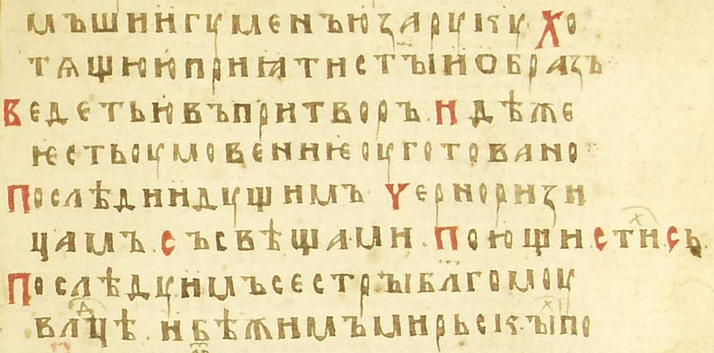

<!--- Чин женского пострижения в великую схиму (ангельский образ) на Руси в XIV–XVII вв. -->

# Введение
В русских требниках от XIV в. и до сер. XVII в. совместно с чином пострижения в великую схиму мужчин, можно найти особый чин для постригающихся женщин, именуемый _«чин пострижения черниц ангельского образа»_
^[Т.е. пострижения черниц (монахинь) _в_ ангельский образ (великую схиму).],
отличающийся особыми песнопениями, наличием обряда омовения ног в начале и рядом других элементов<!--- •• есть ли реально др. эл–ты? -->.
В ходе книжной справы 1640-60-х гг. чин исчезает так как отсутствует в греческих книгах, по которым проводилась справа. 
В настоящее время для мужского и женского пострига предназначен один чин.
Несмотря на исчезновение из требников, чин как и монашеская традиция вызывали большой интерес в XIX веке, о чём может свидетельствовать его описание в реалистическом романе «На горах» П. Мельникова-Печерского[^1], с подробным и правильным приведением начальных строк особых стихир и антифонов чина, а также верно описанной структурой.

**Цель** данной работы -- историко–литургический анализ особого чина пострижения в великую схиму женщин, известного также как *пострижение черниц ангельского образа*, использовавшегося на Руси в XIV--XVII вв..

Для достижения поставленной цели необходимо:

- описать структуру и состав чина по его представлению у Н. Ф. Красносельцева и по оригинальным источникам;
- выявить отличительные особенности чина относительно чина посвящения в девы и современного чина пострига в великую схиму;
- рассмотреть теории о возможных историко–литургических предпосылках формирования чина.

Последнее подробное описание чина сделано Н. Ф. Красносельцевым в 1889г.
С тех пор стал известен новый источник – Дмитриевским А. А. описан Евхологий Стратигия (Paris. Coislin. 213, 1027г.)[@dmitriyevskiy.opisaniye.1901].
Также в настоящее время в связи с глубокими изменениями в социальном, культурном и духовном контексте жизни христиан возобновляется интерес как к теме христианского иночества в современном мире, так и к теме женского церковного служения.
Примеры такого интереса – периодически совершающиеся в ХХ в. хиротонии православных диаконисс, а также восстановление в католической церкви на II Ватиканском соборе чина поставления дев.
Это обуславливает __актуальность__ темы.

**Степень изученности и источники**.
Чин «пострижения черниц ангельского образа» встречается в рукописях, хранящихся в Соловецкой библиотеке, библиотеке Троице-Сергиевой Лавры и в более поздних печатных Московский потребниках: Филаретовском (1625 г.), Иноческом (1639 г.), Иосифовском (1651 г.). 
В Русской Церкви наиболее ранний источник -- славяно-русский Требник XIVв. Московской Троице-Сергиевой лавры №229, ЛЛ. 29--35, где он появляется под названием «Служба скымихя на пострижениiе черницам».
Чин встречается не во всех сборниках, Н. Красносельцев свидетельствует, что ему не удалось обнаружить его в требниках Синодальной библиотеки, однако удалось – во многих рукописях Соловецкой библиотеки.
В ходе данного исследования нам удалось обнаружить чин также в ряде рукописей библиотеки Троице–Сергиевой лавры
В XIX в. чин был вновь найден и описан Н.В. Красносельцевым[@krasnoseltcev.uprazdnenniye.1889 С. 134--169] в ходе исследования рукописей Соловецкой библиотеки.

Для сравнения с современными службами использовались Архиерейский чиновник ..., а также ... 

# Предпосылки и предшественники возникновения особого чина для женского пострига. Гипотезы об истории возникновения и практике использования чина
Наиболее раннее изложение этого чина было найдено проф. А. Дмитриевским в Евхологии Стратигия (Paris. Coislin. 213, 1027г.)[@dmitriyevskiy.opisaniye.1901 С. 1031–1046] в Парижской Национальной библиотеке.

Однако, уже в Евхологии Барберини (nnn) встречается чин пострижения, в котором малый постриг непосредственно переходит в великий постриг.
Отдельным разделом представлены молитвы для женского пострига, которые по содержанию и порядку могут быть вставлены в чин пострига на место исходных молитв, предназначенных для мужчин.
Это позволяет сделать вывод, что в VIII в. существовал единый чин, но с различием в молитвах (и, возможно, песнопениях, которые не помещались в евхологиях), которые уделяют внимание разным темам: ..., ...

Другой источник IX в., патр. Никифор (806–815 гг.) подтверждает наличие у греков мужского и женского чинов пострижения, каждый – с особенными тропарями[@krasnoseltcev.uprazdnenniye.1889 С. 143–144].
В русских чинах отличие в молитвах отсутствует <!--- так ли это? -->

_В последующей [после Coislin] греческой традиции этот чин не сохранился и не вошел в печатные греческие богослужебные книги, однако, по-видимому, рано был переведен на славянский язык и был в ходу в славянских Церквах, в частности в Русской, и до сих пор применяется у старообрядцев._
[@jheltov.seminar.2017]

_Митрополит Кипріанъ въ своихъ „Ответахъ игумену Афанасію" писалъ: „Постриганіе же чернцемъ и черніцамъ едино есть, но токмо молитвы егда прочитаетъ пострмгальныя и пріидетъ, идеже имена святыхъ и пренодобныхъ отецъ написана суть, тогда пременяютъ имена на преподобныхъ святыхъ женъ"_
^[Цит. по: [@krasnoseltcev.uprazdnenniye.1889 С. 134]]
Красносельцев предполагает, что эти слова являются не констатацией факта, а озвучиванием нормы, от которой в то время существовало отклонение – особый чин для женщин, как бы излишний[@krasnoseltcev.uprazdnenniye.1889 С. 139–140].

С другой стороны, в 14 в. можно обнаружить и...
^[Н. Ф. Красносельцев пишет, что «чин пострижения черниц...» появляется в русских сборниках в 15 в., но славяно-русский Требник XIVв. Московской Троице-Сергиевой лавры №229, ЛЛ. 29--35, где он появляется под названием «Служба скымихя на пострижениiе черницам», свидетельствует о более раннем возникновении чина.]

Ввиду утери множества источников на Руси в монгольскую и домонгольскую эпохи, трудно восстановить наверняка преемество женского чина пострига с греческими чинами VIII–IX вв., но его можно предполагать, опираясь на наличие в чине обряда омовения ног.
По структуре и содержанию молитв, чтений, песнопений, действий, он точно повторяет омовение ног в кафедральных соборах в Великий Четверг. 
Обряд в этот день совершался также и в монастырях, где как и в исследуемом чине, его совершал игумен(ья)[@krasnoseltcev.uprazdnenniye.1889 С. 149].

По поводу соединения чина с постригом, Красносельцев предполагает причину в приурочении чинов поставления дев к определённым праздникам (Пасха, апостолов Петра и Павла, Богоявления), подобно крещениям. Об этом пишет и св. Амвросий Медиоланский в Exhortatio virginatis: «пришёл день Пасхи: во всём мире совершаются таинства крещения, возлагаются покрывала на священных дев». Великий четверг же оказывался днём, к которому приурочивали множество священнодействий, в т.ч. совершаемых епископом: освящение мира, воссоединение кающихся, общее елеосвящение. Вероятно, и освящение дев, которое тоже мог творить только епископ, совершалось в этот день. Так, соединённые в записях, чины могли слиться, когда были забыты изначальные смыслы их нахождения рядом[@krasnoseltcev.uprazdnenniye.1889 С. 150].

По Н. Красносельскому, особые молитвы для женского пострижения вышли из употребления ок. IX в., однако Евхологий Coislin показывает обратное: в нём уже содержатся не просто отдельные молитвы, но целый особый чин... <!--- •• как–то его надо расшифровать с греческого... -->,
включающий в себя обряд омовения ног и особые антифоны.
Другие памятники X–XII вв., однако, не включают этих молитв и чина: Вессарионовский евхологий X–XI вв., глаголический Синайский требник XI в.
Н. Красносельцев предполагает, что могли сохраняться особые песнопения для женского пострига[@krasnoseltcev.uprazdnenniye.1889 С. 148],
которые «сделались известны» на Руси в XV в., и ещё более – вместе с книгопечатанием в XVII в. до самого своего исчезновения в ходе «справы».
Однако, чин омовения ног вряд ли мог присоединиться к чину женского пострига на Руси независимо.
Из этого можно предположить, что этот особый сложный и самобытный чин, образовавшись на Западе, именно в таком виде, а не в виде отдельных песнопений и молитв, попал на Русь в XI–XIV вв.

Согласно гипотезе Н. Пальмова, чин мог попасть в русскую церковь благодаря южно-славянскому влиянию на русское богослужение XIVв.[@palmov.postrijeniye.1914 С. 14], чему дополнительное свидетельство -- аналогичный чин с похожим названием «Служба на пострижениiе черноризици» в южно-славянском Требнике Имп. СПБ. Публ. библ. №21 из собрания А. Ф. Гильфердинга, ЛЛ. 37--51.

Другая гипотеза, способная поддержать эту дату, связана с отсутствием чина в славяно–русской версии Евхология Великой церкви Син. 900.
Согласно этой теории, ряд молитв, в т.ч. последования монашеских постригов отсутвуют в славянских рукописях по той причине, что переводчик выбирал только чины, неизвестные на Руси[@afanasyeva.slavyanskaya.2015 С. 30].
^[В рукопись вошли две молитвы для вступления в монашество, которые действительно не встречаются в более ранних русских требниках: чин для желающего стать затворником и чин для принимающих послушнический обет в обители.]
А значит, на момент создания Син. 900 (рубеж XIV–XV вв.), особый чин женского пострига с омовением ног уже использовался.

# Структура чина по Н. Красносельцеву
## Омовение ног 

Начинается обряд после утрени, когда в келью желающей принять постриг приходят инокини.
Песнопения в этом месте специально подобраны к женскому чину и непосредственно обращены к постригающейся.
После первой стихиры в чине появляется священник (неясно, вышли ли сёстры из кельи к нему, или он вошёл к ним).

- **инокини приходят в келью к постригаемой**
^[Действия в чине выделены мною для наглядности – _А.Т._]
- <!--- 14в. -->инокини поют стихиру: «Послушай Христа, что вопиет дево, крест вземше иго мое на раме. Иди и отверзися земных да не привлечетъ тебе страсть ни пища чревная тя лишить истиннаго [вечнаго – 14в.] живота. Внемли утверждай [и удержи – 14 в.] страшное обещание где пасетъ и где пребебываетъ егоже любитъ душа моя [твоя – 14 в.]»
- <!--- 14в. стихира: «Блаженни непорочни...»-->
- <!--- 15в. 230 -->священник произносит обычное начало (Благословен Бог наш; Трисвятое; Отче наш; Приидите поклонимся;
- <!--- 15в. 230 -->Псалом 50
- Канон великой схимы, какой пелся и поётся сейчас в мужском великом постриге
^[Краегласие канона: «Благоискусный конец, благоискусну ми сущу, Христе, подаждь». Начало 1–го ирмоса: «Грядите, людие, поим песнь Христу Богу, раздельшему море и наставльшему люди, яже изведе из работы египетския, яко прославися. / Ко Твоему человеколюбию притекшаго, Христе, во святый образ ныне приходящаго, душевною любовию и мыслию любодобродетельною, Спасе, приими». См. напр.: [@4in.velikayaSkhima.1998]] 
- **игуменья за руку ведёт постригаемую** в притвор церкви, где приготовлено всё для омовения ног; **монахини со свечами следуют за ними и поют** (рис. [@candleBegin]) стихиру: «Последуимъ сестры благому владыце, уведимъ [бежимъ] мiрскыхъ похотий» и богородичен: «Грешныхъ молитвы прiемлюще скорбящихъ въздыханiа не презри»

<!--
«Последуимъ сестры благому владыце, уведимъ [бежимъ – 14 в.] мiрскыхъ похотий убежимъ лестьца мира и миродержителя и будем чисти свершени [къ ствршему ны – 14 в.]. Почтимъ образъ, устыдимся звания, что творимся сами смирени высоци бывша, что въ видимых пребываем. Кождо насъ себе плодъ принесетъ Христови [Владыце – 14 в.] по данней Ему [Его нам – 14 в.] благодати. Да всякыми мерами благодателю тамо сущая славы обители наследуемъ.» 
-->

{#candleBegin1}

- в притворе, где приготовлено умывание, сёстры поют три антифона:
	- «Умывый нозе святых ученикъ, и нас оцести от беззаконий нашихъ»
	- «Подаси грехов оцесцение умывающимся рабом своим»
	- «Союзомъ любви связуеми апостоли» – взят из чина омовения ног в Великий Четверг
- ектенья с прошением «о быти сеи на омовение скверны греховныя»
- две молитвы из чина омовения ног
	- <!--- архиер. -->«Боже преблагий, неприступный божествомъ, иже во зраце рабiи служителя образъ воспрiемый...»
	- <!--- архиер. -->«Господи Боже нашъ, показавый намъ меры смиренiя въ твоемъ превысокомъ снизхожденiи...»
- чтение Евангелия от Иоанна от слов «Иисус, зная, что Отец всё дал Ему в руку...»^[«Въ время оно, ведый Иисус, яко вся дастъ ему Отецъ въ руце»] (Ин 13:3). На словах «И начал мыть ноги учеников и отирать полотенцем, которым был опоясан»^[«И нача нозе умывати ученикомъ, и отирати лентиемъ, имже бе препоясанъ»] (Ин 13:5b), чтение прерывается, **игуменья препоясывается «понявою» и умывает ноги желающей принять пострижение и отирает их «лентiемъ»**.
- во время омовения, трижды поют стихиру: «Умый нозе честная мати и обуй мя сапогомъ целомудрiя, да не пришедъ врагъ обрящетъ пяты моя нагы и запнетъ стопы моя» и богородичен: «Имуще тя, Богородице, упованiе»
^[В архиерейском чине умовения ног присутствует также мистерия, здесь опускаемая: предстоятель с первым, кому ему предстоит омыть ноги, произносят реплики Христа и ап. Петра от слов «Господи, Ты ли мне моешь ноги?» (Ин 13:6) до «И вы чисты, но не все» (Ин 13:10) [@4inovnik.arhier2.1983 С. 88–89]]
- по окончанию омовения, дочитывается Евангелие от слов «Когда же Он умыл их ноги и взял одежду Свою и возлёг снова, Он сказал им: знаете ли, что Я сделал вам?»^[«Во время оно, егда умы Иисус нозе учеником, и приятъ ризы своя и возлеже, пакы рече им, весте ли что сътворих вы?»] (Ин 13:12) до Ин 13:17
- сёстры поют тропарь «Господа глашаете мя и учителя» со стихом «Окропиши мя иссопомъ», и во время пения **игуменья и сёстры кропят «на лица своя отъ воды умыванiя»**
^[Здесь также опускается молитва, завершающая архиерейский чин омовения ног: «Господи, Боже нашъ, иже по мнозей милости Своей истощивый Себя и зракъ раба прiемый...» [@4inovnik.arhier2.1983 С. 90–92]]

## Литургия слова и пострижение 

<!--
После омовения ног в притворе игуменья, постригаемая и сёстры входят в церковь.
По входу в церковь начинается литургия с чином пострижения в великую схиму и особыми антифонами, тематически подобранными к женскому постригу.
По ходу пения антифонов, постригаемая движется к алтарю, с тремя остановками: в начале (притворе), у амвона и перед царскими вратами.

Постриг продолжается в два этапа: сперва постригает священник, а затем сёстры – в дьяконнике или на паперти.
Так же происходило и в мужском чине.
Иногда между постригами было целование постригае(мой/ого).
Иногда второй этап пострига совершался при участии небольшого числа братьев (сестёр), а именно восприемников.
-->

-   **игуменья, постригаемая и сёстры входят в церковь с пением** тропаря «Къ тебе утреннюемъ милосердому, умывше нозе» и богородичен: «Избави насъ от бедъ нашихъ мати Христа Бога» 
-   великая ектенья 
-   <!--- сюда сразу после обычного начала ТСЛ Ф. 304. № 224, 1474 г.-->1-й антифон: «Хотех слезами омыти моихъ греховъ, Господи, рукописанiе...»
^[Тексты всех антифонов в этом чине – особые, специально подобранные или написанные для чина. Подробнее см. [@sec:anti]]
- **постригаемая подходит к амвону**
- 2-й антифон: «Где есть мирская краота, где есть временныхъ мечтанiе...» 
- **постригаемая подходит к царским вратам** 
- 3-й антифон: «Господи отверзи двери чертога рабе твоей...» 
- «Придите, поклонимся»; **постригаемая простирается ниц у царских врат** до конца богородична 
- стихира «Прiидите ко мне вси труждающiеся» и богородичен «Иже тебе ради Богоотецъ пророкъ Давидъ» 
- **по окончанию богородична, священник поднимает за руку постригаемую и задаёт ей вопросы** те же, что и в мужском постриге, начиная с: «Что прiиде, сестро, припадая къ святому жертвеннику сему и святымъ сестрам симъ?» 
- вопросы прерываются на «Оглашение великаго образа», которое произносит священни: «Блюди, сестро, какова обетования даеши Владыце Богу. Ангели бо прiидоша невидимо...»
- следует последний вопрос и ответ «И сия вся исповедуеши о уповании силы Божия, в сих обетех терпети обещаваешися до кончины живота своего, благодатiю Христовою» – «Ей, Богу поспешьствующу ми, честный отче»
- священник произносит молитву: «Прещедрый Богъ и многомилостивый сый, иже причистыя утробы своея, неизследимою благодатию отверъзаа всякому приходящему к Нему, желанiемъ и любовiю теплою, рекый...»
- священник знаменует крестное знамение на главе постригаемой, она опускается в земной поклон, пока он произносит оглашение и главопреклонную молитву: «Ты, владыко, вседержителю, вышнiй Царю славы... призри милостивыным окомъ на смиреную рабу свою _имрк_, иже взъложи и исповеда пред многыми послухы...»
- __священник кладёт ножницы на Евангелии__, возглас «Мир всем!», главопреклонная молитва («въслух всемъ»): «Святый Господи силъ, Отче... благослови рабу свою сiю, _имрк_, юже избрал десница Твоя и сподоби ю быти преподобной рабе...»
- **пострижение** 
- **сёстры вводят постригаемую в диаконник или на паперть и постригают**, воспевая целиком 17-ю кафизму («Блаженны непорочные») 
- в это время читаются Апостол и Евангелие, что и в мужском постриге

## Литургия верных и облачение 

После пострига, сёстры вновь ведут новопостриженную в церковь. Следует её второе приближение к алтарю с тремя новыми антифонами и остановками в тех же местах. В этот раз по приближении к царским вратам, её вводят в алтарь и начинается облачение.

-   **новопостриженную сестру вводят в церковь** «въ конечней ризе[^2], неопоясану, непокровенну, необувенну»

-   3 антифона «Евангельского гласа вскоре повеленiе исполнила еси»

-   во время пения антифонов **новопостриженная приближается к алтарю и к третьему встаёт у царских врат**

-   **новопостриженная входит в алтарь**

-   **священник облачает её в великосхимнические одежды**, комментируя каждый предмет облачения. В это время сёстры поют стихиры, что и в мужском пострижении

-   молитвы священника: Господи Боже нашъ введи рабу твою» и «Господи Боже нашъ, верныхъ въ обетованiи»

-   стихиры «Да возрадуется душа моя о Господе», «Сорадйтеся ми о Христе сестры» и др.

-   **целование Евангелия и новопостриженной**: дьякон встаёт в царских вратах, держа Евангелие вне врат. Новопостриженная целует Евангелие и встаёт рядом с дьяконом. Игуменья и сёстры по очереди целуют Евангелие, а затем новопостриженную и трижды поют стихиру на 1-й глас: «Разумеимъ сестры таинства силу» и богородичен «Радуйся Богородице, дево, радуйся похвало»

-   литургия далее завершается как обычно

## Трапеза и третье введение в церковь 

В завершение пострижения игуменья, новопостриженная и сёстры покидали храм для совершения трапезы. После трапезы, игуменья вновь вводила за руку новопостриженную в церковь, где та оставалась 7 дней до молитвы на снятие кукуля. На 8-й день над ней читается та же молитва на снятие кукуля, что и в мужском постриге.

-   после отпуста литургии **сёстры с новопостриженной выходят из церкви на трапезу с пением** тех же стихир, что и в мужском постриге

-   по окончанию трапезы поются стихиры «Аще внешняго совлечеся одеянiя» и «Премудрый Павелъ невестоводитель бываетъ на небесехъ тайно принося мир обрученiе Христово»

-   **игуменья за руку вводит новопостриженную в церковь в третий раз**

-   в это время сёстры поют стихиры «Господи, Господи, призри съ небесе и виждь» и богородичен «Свеще неугасимая»

-   в церкви поются несколько песнопений, специально выбранных для женского пострижения, последнее из которых «Чистъ ест бракъ и нескверненъ, о дево, неугасиму свещу соблюдай всегда»

-   по окончанию пения **сёстры расходятся по кельям, а новопостриженная остаётся в церкви**

# Особенности в форме и символике действий и песнопений в чине
<!--- соединить с 3–й главой, добавить описанные там элементы в параграфы главы;
сравнением с др. чинами подчеркнуть особенности символики -->

## Омовение ног 
_встречи постригаемой у келии со свечами (иллюстрацией чего может служить известная картина М.В. Нестерова «Великий постриг»_

Омовению ног предшествуют не встречающееся в чине Великого Четверга песнопения. По входу в келью желающей принять постриг, сёстры поют стихиру:

*Послушай Христа, что вопиетъ, о дево. крестъ вземши, иго мое на раму, иди отвержися земныхъ. да не привлечетъ тебе страсть. ни пища чревная тя лишитъ, истиннаго живота. внемли, утвержай страшное обещание. где пасетъ, где пребываетъ. егоже любитъ душа моя.*

Потом, с зажжёнными свечами, следуя за игуменьей и постригаемой в притвор:

*Последуемъ сестры благому владыце, увядимъ мирския похоти. бежимъ лестьца мира, и миродержителя. будемъ чисти и совершени, почтемъ образъ, устыдимся звания. преложимъ житие. что творимся сами смирени, высоцы бывше. что в видимыхъ пребываемъ. темъ каяждо насъ себе плодъ принесетъ Христови, по данней ей благодати. давсякими мерами добродетелей, тамо сущая славы обители наследуемъ.*

Небольшие изменения касаются объекта прошений на ектенье и в молитвах, который из «нас» превращается в «её». Так, в молитве «Боже преблагий, неприступный божествоъ, иже во зраце рабий служителя образъ восприемый», появляется «греховныя скверны омы ти рабы своея, *имрк.*, сподоби прикосновениемъ воды сея. да чиста душею же и теломъ бывши, благоугодно ти послужит...».

Опускаются стихиры из чина омовения ног, которые поются, когда архиереи или пресвитеры, изображающие учеников, по двое выводятся из алтаря протодьяконом и дьяконом к месту омовения[@4inovnik.arhier2.1983 С. 82–83].

## Антифоны {#sec:anti}
Песнопения сосредоточены на образах брака с непорочным Женихом Христом и Царства Небесного как брачного чертога, что отличает их как от песнопений мужского чина, главным образом которого является покаяние, так и от молитв из чина поставления дев (...), где на первом месте личный подвиг девства.

Как уже было сказано, песнопения в чине значительно отличаются по тематики от используемых в мужском постриге на Руси в это время. Последние объединены темой покаяния в образе возвращения блудного сына[@krasnoseltcev.uprazdnenniye.1889 С. 144--145]. Женские же песнопения связаны с темами возрастания в добродетели и духовном бодрствовании в образах обручения с Женихом и ожидания Его подобно разумным девам с горящими светильниками:

Первый антифон -- стихира покаянная в неделю вечера на 4-й глас, также поющаяся в неделю о самарянке. В ней есть образ и покаяния, и невесты: «коль возлюблена села твоя Господи силъ... единъ человеколюбецъ Богъ нашъ тя ныне приемлет дево, того всею душею возлюбивши, потому покажи чистое житие. угоди успешно зовящи...». Постригаемая сравнивается с возлюбленной и призывается хранить верность этой любви (ещё пока не браку). Здесь есть и дерзновенное прошение возлюбленной: «приими мя ходящую во следъ тебе, краснаго жениха моего. не попусти врагу хвалитися мною...».

Второй антифон развивает эти образы, становясь как бы иллюстрацией библейской Песни Песней: «Распни уды христолюбивая. умертви страсти воздержаниемъ, и к жениху си теци и взови. где пасеши женише. где живеши рцы ми. яко тебе возлюбивши притекох. на рамо крестъ твой вземши. да вниду в чертогъ свещу носящи, ико дева чистая...». Здесь постригаемая сравнивается с взывающей и ищущей жениха возлюбленной. К этому яркому, порывистому образу примыкают крест, горящая свеча, чистота, а позже мученица Фекла, риза нетления, Богородица -- образы верности и испытанности.

К третьему антифону постригаемая стоит перед царскими вратами, и в это время поётся: «Господи, отверзи двери чертога рабе твоей, верою припадающи...». Так, образ ищущей чертога жениха в песнопениях дополняется движением к чертогу-алтарю в ходе службы. В антифоне есть прошения: «сподоби ю всесилне, святаго твоего звания, и спричти ю паствы твоея, Иисусе мой. хотяй спасти всех нас, и отверзи двери правды... Отверзи двери правды, вшед в ня... Господи, оружие ми подай же на ратоборца. верою и надеждою и любовию укрепи мя всесилне нань яко человеколюбец. побеждьши его съкрушу и поеру, хотяй всех нас спасти». Здесь о постригаемой молятся как о воине, выходящем на битву с лукавым.

Тогда как образы 3–го антифона схожи с образами в мужском пострижении (напр. ...), 1–й и 2–й являются уникальными для этого чина (а связи с тв брака нет?).
Н. Красносельский предполагает предпосылки этого содержания песнопений с институтом дев в ранней церкви[@krasnoseltcev.uprazdnenniye.1889 С. 147].
По его мнению, женское монашество образовалось позднее под влиянием традиции мужского монашества из чина дев церковных, носивших на главе плат _velatio_[@pravenc.devy.20] подобно замужним, – оттуда в нём идея небесного брака и обручения со Христом.

Однако, сравнение с чином дев...
^[Которого Н. Красносельский не знал.]

Красносельцев упоминает возможные истоки образности песнопений чина и более ранних молитв из Евхология Барберини[^4] в чинах поставления дев и вдовиц церковных[@krasnoseltcev.uprazdnenniye.1889 С. 145--146]. В обоих случаях основным является образ обручения с небесным женихом и ожидания его с горящим светильником.

Девы и вдовицы не рукополагались, о чём сказано в Апостольском предании, среди упоминания других церковных чинов (Trad. Ap. 12), однако в IVв. на Западе формируется velatio[^5] – особый чин посвящения дев через возложение плата им на голову и чтение молитв[@pravenc.devy.20].
В 6-м правиле Карфагенского поместного собора предписывается «освящение дев» не творить пресвитеру и многие комментаторы, в т.ч. Красносельцев трактуют это как возможность совершать чин только епископу.

Согласно Красносельцеву, обряд посвящения в девы состоял из принесения обета девства, «увещания епископа», возложения на голову посвящаемой покрывала. Это покрывало -- flammeum virginale. Согласно античной традиции, при вступлении в брак, на голову женщины надевался плат, называемый flammeum (или velum). Эта деталь обряда бракосочетания вошла в обряд посвящения в девы, став в нём вещественной символикой брака.
Девы назывались «невестами Христовыми» начиная с Тертуллиана.

Как минимум до запрета 45-м правилом Шестого вселенского собора, существовал обычай перед пострижением одевать женщину в дорогие костюмы и украшения, словно невесту, и в таком виде приводить в храм.

В чине поставления дев, представленном в сакраментарии Геласия (ок. 750г.), присутствуют молитвы, которые с незначительными изменениями вошли в состав современного посвящения в девы, восстановленного католической церковью после II Ватиканского собора. В этих молитвах также присутствует мотив Жениха-Христа: «They give themselves wholly to Christ, the Son of the ever-virgin Mary, and the heavenly Bridegroom of those who in hist honor dedicate themselves to lasting virginity[^6]» и даётся образ рождения от Духа: «Your children are born, not of human birth, nor of man's desire, but of your Spirit». Но, значительно больше внимания уделяется образу девства: «They place in your hands their resolve to live in chastity... Among your many gifts you give to some the grace of virginity... Those who choose chastity have looked upon the face of Christ, its origin and inspiration... in his honor dedicate themselves to lasting virginity...» -- четыре и даже более упоминания девственности втечение одной молитвы! И Христос также описан как образец и вдохновение для целибата.

Так, в чине поставления дев основное внимание оказывается на личном подвиге девства, а не на браке со Христом, как в постриге черниц ангельского образа. В обоих чинах присутствуют прошения на укрепление и защиту от искушений, но в чине дев отсутствует образ брани духовной и ожидания со свечой в руках Жениха. Последний образ может быть особенно важной отличительной чертой русского чина, потому как сообщает ему эсхатологическое измерение и дополняет яркую тему влюблённости духовной трезвостью взыскующей нетленного царства.

Помимо этих отличий, есть и важное сходство, касающееся вне-литургического аспекта обоих чинов.
Одна из задач чина дев, согласно свт. Амвросию Медиоланскому, -- укрепление для преодоления сопротивления христианству в семье: «та, которая победила дом, победила век» (Ambros. Mediol. De virginib. 1. 12. 64). А согласно 140 правилу Карфагенского Собора, -- и для укрепления «в опасности угрожающей целомудрию девы, когда есть подозрение или о любителе сильном, или о каком либо похитителе».

Итак, выделяются две тематические линии: 1) бракосочетание с Женихом-Христом и 2) укрепление уз семьи духовной для преодоления сопротивления как собственной плоти, так и семьи по плоти. Вероятно, обе они оказывались актуальными и на Руси в среде женского иночества XIV--XVIIвв..

XIX век как время особого раскола между церковным и светским обществом, вдвойне привлекал внимание к этим темам. 
Первая привлекала своим мистицизмом уставшую от просвещенческого рационализма интеллигенцию, вторая оказывалась актуальна для верующих женщин в среде светского небрежного, а иногда и агрессивного отношения к церкви. 
Здесь можно вспомнить такие произведения как роман «Дворянское гнездо» Тургенева, где героиня против воли семьи уходит в монастырь, картину Нестерова «На горах» и многие другие его картины, связанные с образами монашества и великой схимы. 
Наконец, в романе Мельникова-Печерского «На горах» даётся довольно выпуклый образ на эту же тему: читатель видит чин глазами купца, страстно влюблённого в монахиню и надеющегося похитить её из монастыря. 
Когда он признаёт в постригающейся ту самую, кого чаял похитить, его мечты рассыпаются.

## Движение к алтарю под пение антифонов 

В некоторых случаях даже «ползёт из притвора в центральную часть храма, сопровождаемый двумя старшими иноками, которые прикрывают его своими мантиями» и затем «лежит лицом вниз, распростерши руки крестообразно» посреди храма[@illarion.prvslMonash.2009], то есть возле амвона, где его поднимает за руку игумен.

Дважды в течение литургии постригаемая движется от притвора к алтарю под пение антифонов. В разных источниках, её движение заканчивается у царских врат либо уже в алтаре, сперва для пострига, а во второй раз -- для облачения. Первое движение происходит под антифоны на литургии слова, второе -- на литургии верных.

В этом шествии можно увидеть остатки динамики кафедрального станционного богослужения, когда подобное движение от притвора к амвону и затем к алтарю (а клиром -- в алтарь) совершалось всей паствой. Там вход в храм совершался на месте нынешнего «малого входа», а к амвону приступали во время пения Трисвятого для слушания Писания и проповеди. К алтарю приступали на «великом входе» литургии верных.

В чинах постригов эта логика разрушена и остался лишь динамический импульс шествия. К сожалению, он оторван от смысла собственно литургии и происходит параллельно. Особенно это заметно в том, что во время чтения постригаемая и сёстры вовсе отсутствуют. Они в дьяконнике либо в притворе совершают вторую, «братскую» часть пострига и возвращаются лишь с началом литургии верных.

Возможно, этот разрыв богослужебной логики произошёл в связи с многослойностью самого чина пострига, вобравшего, по-видимому, в себя содержание малого и великого постригов, а впоследствие ещё подвергнутого попыткам «свернуть» чин обратно в один из постригов.

## Два входа в алтарь: постриг и облачение

Вход в алтарь тем более интересен, что в настоящее время ни в мужском, ни в женском постриге в великую схиму, постригаемый не вводится в алтарь, если только это не дьякон или священник.

Также интересно, что постриг имеет два этапа: пострижение священником и пострижение сёстрами (по некоторым версиям -- воспреемниками) в дьяконнике или на паперти. Последнее весьма адекватно чину, т.к. монахиня принимается не только игуменьей, но и сестричеством.

В настоящее время пострижение в великую схиму, подобно пострижению в мантию, не имеет второго этапа пострига. Ектенья на постриге переходит прямо в ектенью на облачении, а постриг рукой священника -- в облачение тут же, у царских врат. После того следует обычное завершение чина пострига в великую схиму, а затем -- обычное завершение литургии. Подобный сокращённый чин великой схимы встречается в Евхологии Афоно--Дионисиатской библ. №450 и предназначен для тех, кто уже прошёл чин малого пострига.

С одной стороны, это выявляет «составную» структуру чина великой схимы, которая, вероятно, сохранилась со времён чина изложенного в Евхологии Барберини св. Марка, где также соединены малая и великая схима. Таким образом, можно увидеть изначальную внутреннюю логику: постриг соответствовал литургии слова, а облачение -- литургии верных.

Согласно Пальмову, сокращение в Евхологии №450 избавило чин от лишнего, повторяющегося обряда пострига, сохранив лишь обряд облачения, т.к. мантийный монах уже пострижен и его основное отличие -- облачение. Нельзя не заметить, однако, что сокращение чина выполнено неудачно, с перемещением обряда облачения, логически соответствующего литургии верных, в литургию слова.

Современное же состояние чинов оказывается вовсе неудачным: из малой схимы исчезла вторая часть пострига, а великая схима переместилась целиком в литургию слова. Таким образом, пострижение братьями (сёстрами) вовсе исчезло из современного чина, а облачение потеряло свой торжественный символизм, связанный с литургией верных.

По возвращению в церковь после чтения Писания, постригаемая вновь продвигается под пение антифонов к царским вратам. Далее следует облачение. По разным источникам оно совершается либо «близ» (видимо, имеется ввиду близ царских врат), либо сказано «вшедше же ей в олтарь». Последнее встречается в ряд русских источников более раннего происхождения (Требники №998 (XVв.), №1004 (XIVв.)). Второй из этих требников, при этом, описывает облачение в чине мужского пострига «близ» (Л.139), а женское -- в алтаре (Л.126). Вероятно, раз разделившись, эти два чина развивались самостоятельно.

Пальмов пишет, что согласно правильному переводу места облачения «τὸ βλῆμα» в греческих Евхологиях, «облачение в великосхимнические одежды необходимо представлять происходящим в алтаре у св. престола»[@palmov.postrijeniye.1914 С. 147].

<!--- •• --> Эта «двойная» структура чина, сохранившая в себе, в отл. от совр. чина (<!--- •• и старинного тоже? -->) элементы малого и великого пострига, в XVII вв. вводила в заблуждение и приводила, например, к комментариям в Требнике 1639 <!--- •• -->, что чин понимается как пострижение в малую схиму, хотя по форме совпадает с пострижением в великую схиму, что недопустимо[@uspenskiy.ino4eskiye.2017 С. 143 (сноска)].

Облачение в алтаре более всего напоминает чины поставления на служение.

Введение в алтарь встречается уже в наиболее раннем из известных нам чинов пострижения в Евхологии Барберини[@barberini.evhologiy.2011 С. 210--216]. Этот чин, один из древнейших известных чинов монашеского пострига, состоит из двух частей: малого и великого пострига. В ходе малого пострига, «отрекающийся входит в святилище и приклоняется перед святым жертвенником», что бывает также в чинах рукоположения, в т.ч. диаконисс[^3]. О рукоположении диаконисс в алтаре пишет Неселовский[@neselovskiy.4ini.1906 С. 72], ссылаясь на Матфея Властаря, основного свидетеля по этому вопросу. Далее, одна из молитв древнего чина имеет слова: «Господи Боже истины, именем твоим **возлагаю руку мою на твоего раба** *имярек*... чтобы **служил всегда твоей благости**, поклоняясь и восхваляя твоё имя святое, прославляя тебя во все дни его жизни...».

В чине пострижения черниц ангельского образа осталось простирание перед царскими вратами (и алтарём) перед постригом, после чего священник поднимал постригащуюся за руку. Также, присутствует облачение в алтаре. Антифоны сохранили прошения о духовных дарованиях.

Облачение завершается перед анафорой, и в некоторых источниках сообщается, что новому схимонах(у/ине) давалась свеча, с которой он(а) участвовал(а) в великом входе со свечой[@palmov.postrijeniye.1914] (вероятно, предстоя перед вратами как делают сейчас алтарники).

Хотя маловероятно, что непосредственно хиротония диаконисс повлиял на женский чин великой схимы, но в целом родство с чинами поставления на служение прослеживается. Присутствует даже своеобразное литургическое «служение» (свеча).

<!--
///проникновение эл–тов из Крещения:
В «оглашении» в чине великой схимы есть слова «О новаго звания! О дара тайны! Второе крещение приемлеши днесь, брате, богатствомъ человеколюбца Бога даровъ, и отъ греховъ твоихъ очищаешися, и сынъ света бываеши», а в молитве «Сый Владыко Вседержителю, вышний Царю славы» – «Сопричти его избраннымъ Твоимъ, да будетъ Твой сосудъ избранный, сынъ и наследникъ Царствия Твоего...».

Согласно Н. Пальмову[@palmov.postrijeniye.1914], эти элементы появились в современном типе чина благодаря редакции преп. Феодора Студита. В X–XIвв. чин уже имел такой вид, согласно Евхологию Московского Румянцевского Музея № 474 и Евхологию 1027г. Парижской Национальной (Coislin) библиотеки. В более ранней редакции, в Евхологии Барберини св. Марка эти элементы отсутствуют и чин имеет другой облик.

Впрочем, эти элементы присутствуют и в мужском постриге. Разница в тематизме песнопений: в женском чине образ сочетания со Христом выступает гораздо явственнее.
-->

# Заключение
<!--- переделать выводы, чтобы были пункты, соотв. задачам -->

- попал на Русь в 14 в.
- самобытность тематики брака, в отл. от др. чинов
- сохранилось соединение чинов малой и великой схимы
- уникальный случай входа взрослой женщины в алтарь в ходе богослужения

Чин пострижения черниц ангельского образа -- яркий, самобытный и особенно интересный как сохранивший и древние особенности монашеских чинов, и, вероятно, ещё более древнюю литургическую образность обручения с Женихом. Он вызывает и исследовательский интерес как совмещающий в себе множество элементов различных богослужений: чин омовения ног, чин малой схимы, чин великой схимы, антифонное шествие кафедрального последования литургии. Он интересен и сам по себе как ярко образный, динамичный, особенно благодаря двум антифонным шествиям и входам-выходам.

Чину присуща определённая поэзия, вероятно не только сохранённая, но и доосмысленная и обогащённая особенностями как русской, так и женской души. Образы, знаки, символы в чине поэтически переплетаются: свеча в руке и Богородица как свеча, образы совлечения ветхой одежды и движение в одной сорочке к облачению в алтаре, чертог Жениха искомый возлюбленной и вход в алтарь, где на престоле -- Св. Дары.

С другой стороны, уже в своём первоначальном виде чин являет проблемы, характерные для смешения, расширения в «слабых местах»[@taft.rastut.2009] и последующего урезания важных смысловых моментов. Так, главная бросающаяся в глаза проблема -- смысловая разделённость, параллельность совершающегося пострига и литургии, при их внешнем динамическом объединении. Другая проблема, которую чин унаследовал от предшественников -- запутанность соединения чинов малой и великой схимы. Спор о необходимости слияния ступеней монашеского пострига в одну держится с эпохи преп. Феодора Студита и до наших дней, а попытки то разделить, то объединить чины, не пошли им на пользу.

# Приложение 1. Некоторые из молитв «образа» (258--263), изложенные в Евхологии Барберини св. Марка 

Здесь изложены четыре из шести молитв Евхология Барберини св. Марка[@barberini.evhologiy.2011 С.219--222], наиболее схожие с текстами антифонов чина пострижения черниц ангельского образа и, вероятно, послужившие основой для них.

**\[258\]** Молитва о принимающей образ монашеский.\
Господи Боже наш, так возлюбивший девственность, что назначил матерью твоего домостроительства, сам, Владыкa всяческих, прими твою рабыню *имярек*, восхотевшую оставить эту мирскую и преходящую славу и созерцать твою благость, и удостой ее посещения твоего Духа Святого, даруй ей воздержание и всяческую скромность чтобы, живя угодно тебе, как сияние благоразумия несла светильник, непрестанно исполняясь елеем своих дел, навстречу тебe, жениху небесному. Ибо благословенно и прославлено (твое имя) достойное хвалы.

**\[259\]** Вторая молитва о монахине.\
Боже благ, Отец девственности и возделыватель добродетельной жизни, сохрани эту рабыню твою в красоте избранной, облачи ее сиянием святости и одеждой целомудрия, чтобы заботилась о Господнем, как угодить Владыке, чтобы была святой в телe, в душе и в духе, и, сопричисляясь к сонму разумных дев и неся светильник благочестия, удостоилась войти в небесные чертоги жизни вечной. Во Христе Иисусе Господе нашем, с которым ты благословен, со пресвятым и благим и животворящим.

**\[260\]** Третья молитва образа. Господи Боже нашa, призывающий праведников к святости и грешников к оправданию, и обращающихся быть помилованными, сам, Господи человеколюбец, прими обращение твоей рабыни *имярек*, и по благости прости ее, припадающую перед твоим милосердием в исповедании своих грехов. Искупи ее от всякого греха, да воссияет над всяким нечистым помышлением, очисти ее от всякой скверны плоти и духа и укрепи в исполнении заповедей твоих, сняв с нее суету мирскую и отрезав ей волосы в подражание твоей первомученице Фекле; сделай ее сопричисленной к верным и разумным девам, чтобы в чистоте души и тела принoся добрый плод и возрастая в добрых делах, стала наследницей царства небесного. Во Христе Иисусе Господe нашем с которым ты благословен, с пресвятым и благим.

**\[262\]** Пятая молитва образа. Свят, Свят, обитающий в святыхa, хотящий, чтобы все люди спас- лись и пришли в познание истиныb, так возлюбивший род челове- ческий что вселился и пребывал в немc чтобы он был храмoм твоей славы страшной и бессмертной, ты сказал: если кто хочет идти за мною, да отвергнется от себя, и возьмeт крест свой, и последует за мноюd, сам, Владыка человеколюбец, благоволи к отречению твоей рабыни имярек, наложи на нее иго твое благое и бремя твое легкоеe, сохрани цельными ее Дух, душу и телоf, облачи ее в одежду первуюg духовную и нетленную, одень ее броней верыh и всеоружием Духа Святогоi, препоясай ее чистотой, святостью, целомудриемj, чтобы укрепившись твоей силой против козней дьявольскихk, подвизаться подвигом добрым, совершить твой путь, сохранить твою веруl и получить венец праведностиm, который ты обещал любящим тебяn и соблюдающим твои заповеди. Ибо подобает тебе всякая славаo, честь и поклонение.

# Приложение 2. Источники XIV--XVвв. о введении женщин в алтарь на постриге или облачении 

[\[14c.\_altar\_hair\]]

# Приложение 3. Подробное изложение чина пострижения черниц ангельского образа у Красносельцева 

[^1]: Роман «На горах» написан в 1874-75 гг., что ненамного, но опережает выход книги Н. Красносельцева с описанием чина -- в 1889 г.. Вероятно, он провёл самостоятельные исследования, а также мог получить консультацию от бывшего старообрядца, уставщика Рогожского кладбища Василий Борисов, ставший прототипом Василия Борисыча в его романах. *За этот факт автор работы благодарит Боченкова В., автора книги о Мельникове--Печерском.*

[^2]: Имеется ввиду срачица.

[^3]: Правда, диакониссы при рукоположении лишь приклоняли главу. Диакон вставал на одно колено, а пресвитер -- на оба.

[^4]: Имеются ввиду шесть молитв №258--263 «на пострижение монахинь»[@barberini.evhologiy.2011 С. 176--178]

[^5]: В дальнейшем чин дев упоминается в произведениях св. отцов на Востоке до Vв.. Вероятно, в дальнейшем он был вытеснен женским монашеством и диакониссами, разделившими его функции. На Западе сохранялся особый чин посвящения в дев до XIIIв., который был возрождён в 1970г. в результате II Ватиканского Собора.

[^6]: Здесь и далее молитвы из чина поставления дев цитируются по новому католическому чину, на английском языке.
